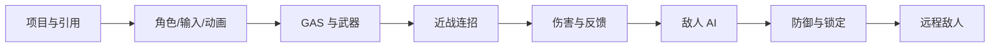

# UE5 C++ 高级第三人称 RPG（第一部分）

> [!info] 笔记范围
> 本系列共 **184 个视频**，对应原课程前 7 个章节。笔记已用 B 站分集目录、课程作者公开的 `WarriorRPG` **301 条 Git 提交历史**、最终 `Source/Config` 和当前本地工程交叉核对。B 站未开放字幕，因此这是一套与课程代码演进相匹配的学习笔记，而不是逐字字幕。

## 内容可信度标记

- **C++/Config 课**：记录实际文件、类、函数、字段、Tag、提交和调用链。
- **蓝图/资产课**：记录提交中真实变更的资产及其与 C++ 的接口契约；无法读取的蓝图内部节点会明确说明，不做臆测。
- **概览/总结课**：整理阶段目标、系统数据流和验收项，没有虚构代码提交。
- **源码审计**：保留公开最终源码中的真实拼写和潜在问题，例如 `Enemy.Status.Unbloackable`、武器 EndOverlap 委托异常等。

> [!warning] 本地工程进度
> 当前 `e:\UE_5.4\Warrior` 的 C++ 实际进度约到 **P16 GAS 基础接入**；P17 之后的笔记依据课程作者公开完整源码整理，并不表示这些代码已经存在于当前本地 `Source/Warrior` 中。

## 课程分类

| 分类 | 视频范围 | 数量 | 主题 | 笔记 |
|---|---:|---:|---|---|
| 项目基础 | P1-P4 | 4 | 项目、测试地图、资源引用 | [[01-项目基础]] |
| 英雄角色与基础框架 | P5-P22 | 18 | 输入、动画、GAS、武器、启动数据 | [[02-英雄角色与基础框架]] |
| 近战连招系统 | P23-P46 | 24 | 技能输入、蒙太奇、动画层、轻重攻击 | [[03-近战连招系统]] |
| 英雄战斗与反馈 UI | P47-P93 | 47 | 属性、伤害、受击、死亡、血条与 HUD | [[04-英雄战斗与反馈UI]] |
| 敌人 AI | P94-P126 | 33 | 感知、行为树、EQS、Motion Warping | [[05-敌人AI]] |
| 英雄战斗能力 | P127-P166 | 40 | 翻滚、格挡、完美格挡、锁定、死亡 | [[06-英雄战斗能力]] |
| 远程敌人 | P167-P184 | 18 | 投射物、远程行为树、不可格挡攻击 | [[07-远程敌人]] |

## 推荐学习顺序

## 跨章节核心链路

1. **输入链路**：`InputAction` → `InputConfig` → 自定义 `EnhancedInputComponent` → Gameplay Tag。
2. **技能链路**：输入 Tag → `AbilitySystemComponent` → 激活 `GameplayAbility`。
3. **攻击链路**：技能 → Montage / Gameplay Event → 开启武器碰撞 → 命中目标。
4. **伤害链路**：构造 `GameplayEffectSpec` → 捕获属性 → 计算伤害 → 修改生命值。
5. **反馈链路**：Gameplay Cue / 动画 / 音效 / 镜头震动 / Hit Pause / UI。
6. **AI 链路**：AI Perception → Blackboard → Behavior Tree / EQS → AI 技能。

## Obsidian 使用方式

- 在每一集标题下补充自己的代码文件、蓝图资产和问题记录。
- 使用 Obsidian 双链关联现有笔记，例如 `[[02-英雄角色与基础框架]]`；源码符号使用反引号，例如 `WarriorHeroAnimInstance`。
- 用 `#todo` 标记尚未完成的练习，用 `#bug` 记录问题，用 `#review` 标记需要复习的概念。
- 每完成一个视频，可在对应条目下添加 `状态:: 已完成`。

## 资料

- [B 站课程（第一部分）](https://www.bilibili.com/video/BV12YCrYCE62)
- [Udemy 原课程](https://www.udemy.com/course/unreal-engine-5-advanced-action-rpg/)
- [Gameplay Ability System 文档](https://dev.epicgames.com/documentation/en-us/unreal-engine/gameplay-ability-system-for-unreal-engine)
- [Enhanced Input 文档](https://dev.epicgames.com/documentation/en-us/unreal-engine/enhanced-input-in-unreal-engine)

## 学习看板

- [ ] [[01-项目基础]]
- [ ] [[02-英雄角色与基础框架]]
- [ ] [[03-近战连招系统]]
- [ ] [[04-英雄战斗与反馈UI]]
- [ ] [[05-敌人AI]]
- [ ] [[06-英雄战斗能力]]
- [ ] [[07-远程敌人]]
