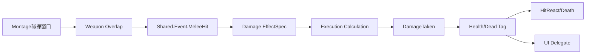

# 04 英雄战斗与反馈 UI

上一章：[[03-近战连招系统]]　返回：[[00-课程索引]]　下一章：[[05-敌人AI]]

> [!info] 本章重点
> 本章建立完整闭环：碰撞只报告命中，Gameplay Ability 构造伤害 Spec，Execution Calculation 计算数值，AttributeSet 消费元属性，Gameplay Event/Cue 负责受击和表现，UI Component 通过委托推送数据。

## 战斗主链

```text
Montage NotifyState → 开启武器碰撞
→ Weapon BeginOverlap → CombatComponent 去重
→ Shared.Event.MeleeHit → 攻击 Ability
→ Make GameplayEffectSpec → Apply to Target ASC
→ GEExecCalc_DamageTaken → DamageTaken Meta Attribute
→ AttributeSet::PostGameplayEffectExecute
→ CurrentHealth / Dead Tag / UI Delegate
```

### [P47 Hero Combat Section Overview](https://www.bilibili.com/video/BV12YCrYCE62?p=47)（02:06）

章节概览，无独立提交。路线：敌人框架 → 属性初始化 → 碰撞 → 伤害 → 受击/死亡 → UI。

### [P48 Set Up Enemy Character](https://www.bilibili.com/video/BV12YCrYCE62?p=48)（11:56）

**提交**：`c2be3f2 SetUpEnemyCharacterDone`。

新增：

```text
AWarriorEnemyCharacter : AWarriorBaseCharacter
UWarriorEnemyGameplayAbility : UWarriorGameplayAbility
UEnemyCombatComponent : UPawnCombatComponent
UDataAsset_EnemyStartUpData : UDataAsset_StartUpDataBase
```

`AWarriorEnemyCharacter::PossessedBy` 先通过基类执行 `ASC.InitAbilityActorInfo`，再初始化敌人 Startup Data。敌人能力基类提供 Enemy Character/Combat Component 的强类型访问。

### [P49 Gruntling Guardian](https://www.bilibili.com/video/BV12YCrYCE62?p=49)（10:29）

**提交**：`3f03f4d BeforeGruntling` + `c974653 Guardian done`；资产课。

资产层级：

```text
BP_EnemyCharacter_Base
└─ BP_Gruntling_Base
   └─ BP_Gruntling_Guardian

ABP_Enemy_Base
└─ ABP_Guardian → BS_Guardian_Default
```

配置 Mesh、AnimBP、Character Movement 和 Guardian 专属外观。骨架 Socket、材质和动画状态机需在对应资产中核对。

### [P50 Asynchronous Loading](https://www.bilibili.com/video/BV12YCrYCE62?p=50)（14:38）

**提交**：`ed60d33 AsyncLoading Done`。

```cpp
UAssetManager::GetStreamableManager().RequestAsyncLoad(
    CharacterStartUpData.ToSoftObjectPath(),
    FStreamableDelegate::CreateLambda([this, AbilityApplyLevel]()
    {
        if (UDataAsset_StartUpDataBase* LoadedData = CharacterStartUpData.Get())
        {
            LoadedData->GiveToAbilitySystemComponent(
                WarriorAbilitySystemComponent,
                AbilityApplyLevel);
        }
    })
);
```

- Hero 单实例可同步加载；批量敌人生成改用异步避免卡顿。
- 回调执行前 Owner 可能销毁，生产代码应使用弱引用或再次校验 `IsValid(this)`。

### [P51 Spawn Enemy Weapon](https://www.bilibili.com/video/BV12YCrYCE62?p=51)（07:51）

**提交**：`0653de7`。

资产：`GA_Guardian_SpawnWeapon`、`GA_Shared_SpawnWeapon_Base`、`BP_Guardian_Weapon`。新增 Tag：`Enemy.Weapon`。

```text
DA_Guardian 授予 SpawnWeapon Ability
→ OnGiven 自动激活
→ Spawn Guardian Weapon
→ 设置 Instigator/Owner 并附着 Socket
→ RegisterSpawnedWeapon(Enemy.Weapon, Weapon, true)
```

### [P52 Attribute Set](https://www.bilibili.com/video/BV12YCrYCE62?p=52)（07:08）

**提交**：`94fbaff Attribute set done`。

`UWarriorAttributeSet` 最终属性：

```cpp
FGameplayAttributeData CurrentHealth;
FGameplayAttributeData MaxHealth;
FGameplayAttributeData CurrentRage;
FGameplayAttributeData MaxRage;
FGameplayAttributeData AttackPower;
FGameplayAttributeData DefensePower;
FGameplayAttributeData DamageTaken;
```

每个属性使用 `ATTRIBUTE_ACCESSORS` 生成 Getter、Setter、Init 和 Attribute Getter。`DamageTaken` 是元属性，只作为一次伤害结算中间值。

### [P53 Gameplay Effect](https://www.bilibili.com/video/BV12YCrYCE62?p=53)（09:54）

**提交**：`566432d`；资产课。

- `CT_HeroStats`：按等级提供属性曲线。
- `GE_Hero_StartUp`：初始化属性。
- `GE_Hero_Static`：长期状态/属性效果。

Gameplay Effect 的 `Instant/Duration/Infinite`、Modifier 和 Granted Tag 均在资产中配置，不能只靠文件名猜测精确值。

### [P54 Apply Gameplay Effect To Self](https://www.bilibili.com/video/BV12YCrYCE62?p=54)（05:49）

**提交**：`cb99436`。

Startup Data 新增：

```cpp
TArray<TSubclassOf<UGameplayEffect>> StartUpGameplayEffects;
```

应用：

```cpp
UGameplayEffect* EffectCDO = EffectClass->GetDefaultObject<UGameplayEffect>();
InASCToGive->ApplyGameplayEffectToSelf(
    EffectCDO, ApplyLevel, InASCToGive->MakeEffectContext());
```

这使属性初始化完全由 Data Asset + GE 驱动，而不是角色构造函数硬编码。

### [P55 Init Enemy Attributes](https://www.bilibili.com/video/BV12YCrYCE62?p=55)（09:25）

**提交**：`b094b09`。

资产：`CT_GuardianStats`、`GE_Guardian_StartUp`、`GE_Enemy_Static`、`DA_Guardian`。敌人异步加载 Startup Data 后，以对应 Ability Level 应用启动 GE；Hero 和 Enemy 共用同一 AttributeSet 类型，数值由不同 GE/CurveTable 决定。

### [P56 Pawn Combat Interface](https://www.bilibili.com/video/BV12YCrYCE62?p=56)（19:58）

**提交**：`076b60f`。

```cpp
class IPawnCombatInterface
{
    virtual UPawnCombatComponent* GetPawnCombatComponent() const = 0;
};
```

```text
BaseCharacter：默认返回 nullptr
HeroCharacter：返回 HeroCombatComponent
EnemyCharacter：返回 EnemyCombatComponent
```

AnimNotifyState、Ability 和函数库依赖接口，不需要知道 Hero/Enemy 具体类型。

### [P57 Toggle Weapon Collision](https://www.bilibili.com/video/BV12YCrYCE62?p=57)（08:12）

**提交**：`ab6c256`。

```cpp
enum class EToggleDamageType : uint8
{
    CurrentEquippedWeapon,
    LeftHand,
    RightHand
};
```

```text
ANS_ToggleWeaponCollision Begin
→ ToggleWeaponCollision(true)
→ Weapon Collision = QueryOnly

ANS End
→ ToggleWeaponCollision(false)
→ Collision = NoCollision
→ OverlappedActors.Empty()
```

一次攻击窗口维护命中去重数组，结束时清空。

### [P58 On Weapon Begin Overlap](https://www.bilibili.com/video/BV12YCrYCE62?p=58)（10:12）

**提交**：`babc294`。

`AWarriorWeaponBase::OnCollisionBoxBeginOverlap`：

```text
取得 Weapon Instigator Pawn
→ OtherActor 转为 Pawn
→ IsTargetPawnHostile
→ OnWeaponHitTarget.ExecuteIfBound(OtherActor)
```

武器只检测交互，不直接计算伤害。敌我过滤最终依赖双方 Controller 的 Generic Team ID。

### [P59 On Target Interacted](https://www.bilibili.com/video/BV12YCrYCE62?p=59)（08:35）

**提交**：`3edc506`。

```cpp
DECLARE_DELEGATE_OneParam(FOnTargetInteractedDelegate, AActor*)
FOnTargetInteractedDelegate OnWeaponHitTarget;
FOnTargetInteractedDelegate OnWeaponPulledFromTarget;
```

注册武器时，Combat Component 用 `BindUObject` 绑定命中和离开回调。

> [!bug] 公开最终源码中 `OnCollisionBoxEndOverlap` 误调用 `OnWeaponHitTarget`，而不是 `OnWeaponPulledFromTarget`。这会影响拔出武器事件和 Hit Pause 恢复链，笔记按真实源码保留此问题。

### [P60 Notify Melee Hit](https://www.bilibili.com/video/BV12YCrYCE62?p=60)（11:18）

**提交**：`646c6dd`。新增 `Shared.Event.MeleeHit`。

```cpp
FGameplayEventData Data;
Data.Instigator = GetOwningPawn();
Data.Target = HitActor;
SendGameplayEventToActor(GetOwningPawn(), Shared_Event_MeleeHit, Data);
```

```text
Weapon Overlap → HeroCombatComponent 去重
→ 事件发送给攻击者 Hero
→ 当前攻击 GA 的 Wait Gameplay Event
→ 从 EventData.Target 取得敌人
```

### [P61 Set Up Attack Montages](https://www.bilibili.com/video/BV12YCrYCE62?p=61)（08:25）

**提交**：`46aab11`；资产课。

修改轻/重攻击 Montage、Master Ability 和 `ANS_ToggleWeaponCollision`。每段 Montage 的伤害帧用 Notify State 控制，避免动画未挥到目标就开始检测。

### [P62 Make Gameplay Effect Spec Handle](https://www.bilibili.com/video/BV12YCrYCE62?p=62)（10:16）

**提交**：`ae18278`。

```cpp
FGameplayEffectSpecHandle MakeHeroDamageEffectSpecHandle(
    TSubclassOf<UGameplayEffect> EffectClass,
    float WeaponBaseDamage,
    FGameplayTag CurrentAttackTypeTag,
    int32 UsedComboCount);
```

Effect Context 写入当前 Ability、SourceObject、Instigator；`MakeOutgoingSpec` 使用当前 Ability Level。Spec 是“本次攻击”的数据容器。

### [P63 Hero Damage Info](https://www.bilibili.com/video/BV12YCrYCE62?p=63)（12:04）

**提交**：`4091cff`。

武器数据：

```cpp
FScalableFloat WeaponBaseDamage;
```

```cpp
float UHeroCombatComponent::GetHeroCurrentEquippWeaponDamageAtLevel(float Level) const
{
    return CurrentWeapon->HeroWeaponData.WeaponBaseDamage.GetValueAtLevel(Level);
}
```

新增：`GE_Shared_DealDamage`、`CT_HeroWeaponStats`、`UGEExecCalc_DamageTaken`。SetByCaller 协议：

```text
Shared.SetByCaller.BaseDamage
Player.SetByCaller.AttackType.Light
Player.SetByCaller.AttackType.Heavy
```

### [P64 Apply Effect Spec Handle To Target](https://www.bilibili.com/video/BV12YCrYCE62?p=64)（09:17）

**提交**：`c8150a5`。

```cpp
FActiveGameplayEffectHandle NativeApplyEffectSpecHandleToTarget(
    AActor* TargetActor,
    const FGameplayEffectSpecHandle& SpecHandle);
```

```text
Target Actor → AbilitySystemBlueprintLibrary 获取 Target ASC
→ Source ASC.ApplyGameplayEffectSpecToTarget
→ 返回 ActiveEffectHandle
```

蓝图包装通过 `EWarriorSuccessType` 和 `ExpandEnumAsExecs` 生成成功/失败执行引脚。

### [P65 Capture Relevant Attributes](https://www.bilibili.com/video/BV12YCrYCE62?p=65)（09:15）

**提交**：`a023587`。

```cpp
DEFINE_ATTRIBUTE_CAPTUREDEF(UWarriorAttributeSet, AttackPower, Source, false);
DEFINE_ATTRIBUTE_CAPTUREDEF(UWarriorAttributeSet, DefensePower, Target, false);
DEFINE_ATTRIBUTE_CAPTUREDEF(UWarriorAttributeSet, DamageTaken, Target, false);
```

`false` 表示执行时捕获，不在 Spec 创建时快照。三个定义加入 `RelevantAttributesToCapture`。

### [P66 Retrieve Hero Damage Info](https://www.bilibili.com/video/BV12YCrYCE62?p=66)（11:38）

**提交**：`3657cba`。

Execution 从 Owning Spec 读取：

- Source/Target Aggregated Tags。
- Source `AttackPower`。
- Target `DefensePower`。
- `SetByCallerTagMagnitudes` 中的 BaseDamage 和轻/重攻击 ComboCount。

运行时攻击段数据使用 SetByCaller，稳定基础属性使用 Attribute Capture。

### [P67 Calculate Final Damage Done](https://www.bilibili.com/video/BV12YCrYCE62?p=67)（15:06）

**提交**：`a71d189`。

```text
LightMultiplier = 1 + (ComboCount - 1) × 0.05
HeavyMultiplier = 1 + ComboCount × 0.15
FinalDamage = ScaledBaseDamage × SourceAttackPower ÷ TargetDefensePower
```

输出 Modifier：

```cpp
OutExecutionOutput.AddOutputModifier(
    FGameplayModifierEvaluatedData(DamageTakenProperty,
                                   EGameplayModOp::Override,
                                   FinalDamage));
```

> [!warning] 最终源码没有保护 `TargetDefensePower == 0`；配置必须保证防御力大于零，或代码中做下限约束。

### [P68 Set Up Heavy Attacks For Damage](https://www.bilibili.com/video/BV12YCrYCE62?p=68)（06:00）

**提交**：`680203f`；修改 Heavy Attack Master Ability。

重攻击复用同一伤害 GE/Execution，只把攻击类型和 ComboCount 写入 `Player.SetByCaller.AttackType.Heavy`，从而应用 15% 的重击段数倍率。

### [P69 Modify Health Attribute](https://www.bilibili.com/video/BV12YCrYCE62?p=69)（10:00）

**提交**：`eedc765`。

```cpp
void UWarriorAttributeSet::PostGameplayEffectExecute(
    const FGameplayEffectModCallbackData& Data)
```

```text
DamageTaken → GetDamageTaken
→ CurrentHealth - Damage
→ Clamp(0, MaxHealth)
→ SetCurrentHealth
```

将“算伤害”和“如何消费伤害”分开，便于后续加入 UI、护盾、死亡等逻辑。

### [P70 Hit React Ability](https://www.bilibili.com/video/BV12YCrYCE62?p=70)（12:50）

**提交**：`4f035a6`；资产课。

新增 `Shared.Ability.HitReact`、`Shared.Event.HitReact`，以及 `GA_Enemy_HitReact_Base`、`GA_Guardian_HitReact`、Guardian 受击 Montage。HitReact 作为 Reactive Ability 由 `DA_Guardian` 授予。

### [P71 Trigger Hit React Ability](https://www.bilibili.com/video/BV12YCrYCE62?p=71)（05:51）

**提交**：`5c5fa9b`；蓝图课。

```text
伤害成功应用 → Send Shared.Event.HitReact 给 Target
→ Reactive HitReact Ability 响应
→ 播放 Guardian 受击 Montage
```

P71 本身没有 C++ diff，因此事件具体发送节点以 Ability 蓝图为准。

### [P72 Material Hit FX](https://www.bilibili.com/video/BV12YCrYCE62?p=72)（10:32）

**提交**：`fd88cfa`；材质/蓝图课。

`MI_Guardian` 与 HitReact Ability 实现受击闪白/颜色变化。每个敌人应操作 Dynamic Material Instance，避免修改共享材质影响所有实例。

### [P73 Hit Pause](https://www.bilibili.com/video/BV12YCrYCE62?p=73)（07:36）

**提交**：`0344d2e`。

新增：`Player.Ability.HitPause`、`Player.Event.HitPause`、`GA_Hero_HitPause`。

```text
HeroCombatComponent::OnHitTargetActor
→ Send Player.Event.HitPause 给 Hero
→ GA_Hero_HitPause 执行短暂停顿
```

设计上 EndOverlap 可再次通知恢复；但当前公开源码存在 P59 所述 EndOverlap 委托错误。

### [P74 Camera Shake](https://www.bilibili.com/video/BV12YCrYCE62?p=74)（07:16）

**提交**：`d1d93f3`；资产课。

`CameraShake_HeroMelee` 接入 `GA_Hero_HitPause`。镜头反馈由本地 PlayerController 播放，数值伤害逻辑不依赖镜头表现。

### [P75 Hit React Sound](https://www.bilibili.com/video/BV12YCrYCE62?p=75)（05:47）

**提交**：`8714625`；音频/动画资产课。

Guardian 受击 Montage 加入声音，`Concurrency_OneAtATime` 限制同类吼叫并发，避免连续受击造成声音叠加。

### [P76 Gameplay Cues](https://www.bilibili.com/video/BV12YCrYCE62?p=76)（10:03）

**提交**：`281d901`。

Config：

```ini
GameplayCueNotifyPaths="/Game/GameplayCues"
GameplayCue.Sounds.MeleeHit.Axe
GameplayCue.Sounds.MeleeHit.Stick
```

新增 `GC_Hero_AxeHit`。Gameplay Cue 只负责命中声音/特效，伤害仍由 EffectSpec/Execution 结算。

### [P77 Enemy Death Ability](https://www.bilibili.com/video/BV12YCrYCE62?p=77)（16:31）

**提交**：`a89b6e3`。

新增：`Shared.Ability.Death`、`Shared.Status.Dead`、`GA_Enemy_Death_Base`、`GA_Guardian_Death`。

```cpp
if (GetCurrentHealth() == 0.f)
{
    AddGameplayTagToActorIfNone(TargetActor, Shared_Status_Dead);
}
```

Dead Tag 驱动响应式 Death Ability；具体 Trigger 配置位于能力蓝图。

### [P78 BP Death Interface](https://www.bilibili.com/video/BV12YCrYCE62?p=78)（07:11）

**提交组合**：`8381e98 Enemy death asset done` + `bd72f09 DeathInterfaceDone`。

资产：Guardian 多个 Death Montage、Death Sound Cue、`BPI_EnemyDeath`。接口把通用死亡 Ability 与具体敌人表现解耦：

```text
Death Ability → BPI_EnemyDeath → Enemy Blueprint
→ 停止移动/碰撞/血条 → 播放具体死亡表现
```

### [P79 Dissolve Material FX](https://www.bilibili.com/video/BV12YCrYCE62?p=79)（11:53）

**提交**：`104da4f Material FX done`。

修改角色和武器材质，建立死亡溶解参数。蓝图接口同时驱动角色与武器动态材质，Timeline/曲线控制溶解进度。

### [P80 Dissolve Niagara FX](https://www.bilibili.com/video/BV12YCrYCE62?p=80)（11:01）

**提交**：`3c4042f DissolveNiagaraDone`。

死亡链加入 Niagara 消散表现。应确保 Niagara 有独立生命周期，Actor 销毁时不会过早截断必要特效。

### [P81 Pawn UI Component](https://www.bilibili.com/video/BV12YCrYCE62?p=81)（12:42）

**提交**：`c11c7dd PawnUIComponentDone`。

```text
UPawnExtensionComponentBase
└─ UPawnUIComponent
   ├─ UHeroUIComponent
   └─ UEnemyUIComponent
```

`IPawnUIInterface` 让 AttributeSet 取得角色 UI Component，而不引用任何具体 Widget。

### [P82 Broadcast Value Change](https://www.bilibili.com/video/BV12YCrYCE62?p=82)（13:10）

**提交**：`ed50146`。

```cpp
DECLARE_DYNAMIC_MULTICAST_DELEGATE_OneParam(
    FOnPercentChangedDelegate, float, NewPercent);
```

- `UPawnUIComponent::OnCurrentHealthChanged`
- `UHeroUIComponent::OnCurrentRageChanged`

```cpp
OnCurrentHealthChanged.Broadcast(GetCurrentHealth() / GetMaxHealth());
```

> [!warning] 需要保证 MaxHealth/MaxRage 非零，或代码做除零保护。

### [P83 Listen For Broadcasting](https://www.bilibili.com/video/BV12YCrYCE62?p=83)（12:57）

**提交**：`e9a9a4b`。

`UWarriorWidgetBase::NativeOnInitialized`：

```text
GetOwningPlayerPawn
→ Cast<IPawnUIInterface>
→ GetHeroUIComponent
→ BP_OnOwningHeroUIComponentInitialized
→ Widget 蓝图绑定 Health/Rage 委托
```

Widget 被动接收更新，不在 Tick 中轮询 AttributeSet。

### [P84 Enemy Init Created Widget](https://www.bilibili.com/video/BV12YCrYCE62?p=84)（09:00）

**提交**：`1005675`。

敌人世界空间 Widget 没有 Owning Player Pawn，因此：

```text
EnemyCharacter::BeginPlay
→ WidgetComponent.GetUserWidgetObject
→ UWarriorWidgetBase::InitEnemyCreatedWidget(this)
→ IPawnUIInterface.GetEnemyUIComponent
→ BP_OnOwningEnemyUIComponentInitialized
```

### [P85 Template Widgets](https://www.bilibili.com/video/BV12YCrYCE62?p=85)（11:56）

**提交**：`9c22683`；UMG 资产课。

新增 `TPWBP_StatusBar`、`WarriorSizeBox`、`MI_HeroHealthBar`，删除临时 `WBP_Test`。模板负责通用显示，业务数据仍来自 UI Component 委托。

### [P86 Set Status Bar Fill Color](https://www.bilibili.com/video/BV12YCrYCE62?p=86)（09:19）

**提交**：`25230f2`；仅修改 `TPWBP_StatusBar`。通过暴露 Fill Color/材质参数，让 Health、Rage、Enemy Health 复用同一控件。

### [P87 Template Icon Slot Widget](https://www.bilibili.com/video/BV12YCrYCE62?p=87)（09:37）

**提交**：`be2ce77`。新增 `TPWBP_IconSlot`，统一图标容器布局；后续武器图标、技能图标和冷却遮罩都会复用它。

### [P88 Hero Overlay Widget](https://www.bilibili.com/video/BV12YCrYCE62?p=88)（13:10）

**提交**：`00938cf`。

资产：`WBP_HeroOverlay`、`GA_Hero_DrawOverlayWidget`。启动数据授予 OnGiven UI Ability，创建 Overlay 后通过 `UWarriorWidgetBase` 注入 HeroUIComponent。

### [P89 Enemy Health Widget Component](https://www.bilibili.com/video/BV12YCrYCE62?p=89)（12:43）

**提交**：`553b3ac`。

```cpp
UWidgetComponent* EnemyHealthWidgetComponent;
```

构造时附着到 Mesh；BeginPlay 后初始化 `WBP_DefaultEnemyHealthBar`。血条订阅 `EnemyUIComponent::OnCurrentHealthChanged`。

### [P90 Hide Enemy Health Bar](https://www.bilibili.com/video/BV12YCrYCE62?p=90)（06:49）

**提交**：`cbabfae`；仅修改敌人血条 Widget。显示/隐藏规则完全位于 UMG 资产中，可能根据满血、受伤、死亡或延时控制，精确条件需打开资产确认。

### [P91 Update Weapon Icon](https://www.bilibili.com/video/BV12YCrYCE62?p=91)（08:46）

**提交**：`0a97bdf`。

武器数据：

```cpp
TSoftObjectPtr<UTexture2D> SoftWeaponIconTexture;
```

UI 委托：

```cpp
FOnEquippedWeaponChangedDelegate OnEquippedWeaponChanged;
```

装备/卸下 Ability 蓝图广播软图标，`WBP_HeroOverlay` 更新 `TPWBP_IconSlot`。广播端在蓝图中，C++ 只定义数据与委托。

### [P92 Final Tweaking](https://www.bilibili.com/video/BV12YCrYCE62?p=92)（14:11）

**提交**：`1435e17`。

新增/调整 `MI_EnemyHealthBar`、`MI_HeroRageBar`、Hero Health Material、Overlay、Enemy Health Bar、Icon Slot 和 HeroUIComponent 暴露方式。本节是视觉与参数收敛，不新增战斗算法。

### [P93 Section Wrap Up](https://www.bilibili.com/video/BV12YCrYCE62?p=93)（00:56）

总结课。完整闭环：



## 关键源码审计

- `OnCollisionBoxEndOverlap` 当前委托疑似错误。
- 伤害公式需防御 `DefensePower == 0`。
- UI 百分比需防御 Max 属性为 0。
- `CurrentHealth == 0.f` 因前置 Clamp 通常成立，但 `<= 0.f` 更健壮。
- 蓝图表现不得反向承担权威伤害计算。
