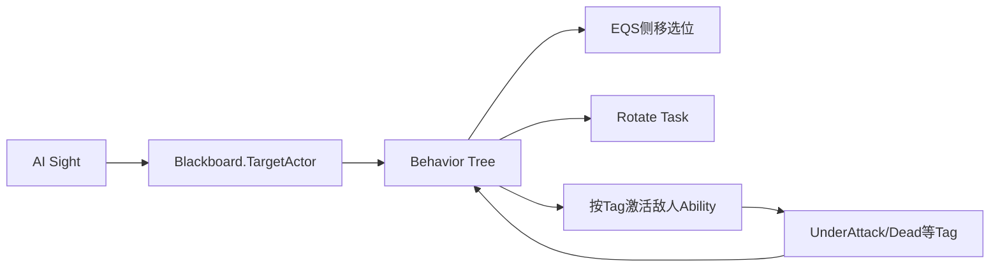

# 05 敌人 AI

上一章：[[04-英雄战斗与反馈UI]]　返回：[[00-课程索引]]　下一章：[[06-英雄战斗能力]]

## 总体架构

```text
AI Perception → Blackboard.TargetActor → Behavior Tree
→ EQS 选择侧移位置 → Rotate/Move Task
→ Activate Ability By Tag → Enemy Gameplay Ability
→ Gameplay Tag 状态反向中止 Behavior Tree 分支
```

### [P94 Enemy AI Section Overview](https://www.bilibili.com/video/BV12YCrYCE62?p=94)（02:24）

章节概览，无独立提交。AI Controller 只负责感知和环境入口；行为树负责编排；EQS 负责选位；GAS 负责攻击与状态。

### [P95 Preparing Enemy For Combat](https://www.bilibili.com/video/BV12YCrYCE62?p=95)（05:07）

**提交**：`29abfad PrearingEnemyForCombatDone`；主要蓝图准备。

本提交只修改敌人蓝图和测试地图，没有新增 C++。它复用 P48 已建立的 `AWarriorEnemyCharacter` 基础配置：

```cpp
AutoPossessAI = EAutoPossessAI::PlacedInWorldOrSpawned;
bUseControllerRotationYaw = false;
GetCharacterMovement()->bOrientRotationToMovement = true;
GetCharacterMovement()->MaxWalkSpeed = 300.f;
```

P95 的工作是让敌人蓝图使用既有配置、指定 Enemy AIController，并在地图中准备有效 NavMesh；不要把上述构造代码误认为本提交才添加。

### [P96 Crowd Following Component](https://www.bilibili.com/video/BV12YCrYCE62?p=96)（09:13）

**提交**：`95acc95`。

```cpp
AWarriorAIController::AWarriorAIController(const FObjectInitializer& ObjectInitializer)
    : Super(ObjectInitializer.SetDefaultSubobjectClass<UCrowdFollowingComponent>(
          TEXT("PathFollowingComponent")))
{}
```

用 Detour Crowd 替换默认 PathFollowing，实现多 Agent 局部避障。

### [P97 AI Perception](https://www.bilibili.com/video/BV12YCrYCE62?p=97)（08:56）

**提交**：`b0ca46f`。

字段：`UAIPerceptionComponent* EnemyPerceptionComponent`、`UAISenseConfig_Sight* AISenseConfig_Sight`。

最终参数：

```text
SightRadius = 5000
PeripheralVisionAngleDegrees = 360
DetectEnemies = true
DetectFriendlies/Neutrals = false
```

`OnTargetPerceptionUpdated` 绑定 `OnEnemyPerceptionUpdated`。

### [P98 Generic Team ID](https://www.bilibili.com/video/BV12YCrYCE62?p=98)（08:54）

**提交**：`6b99af0`。

- Hero Controller Team ID = 0。
- Enemy AIController Team ID = 1。
- 两者实现/使用 `IGenericTeamAgentInterface`。

`AWarriorAIController::GetTeamAttitudeTowards` 的实际规则是：对方存在 Team 接口且 `OtherTeamId < EnemyTeamId` 时返回 `Hostile`，否则返回 `Friendly`，不会返回 `Neutral`。后续 `UWarriorFunctionLibrary::IsTargetPawnHostile` 才采用双方 Team ID `!=` 的判断；两套算法不要混淆。

### [P99 Behavior Tree](https://www.bilibili.com/video/BV12YCrYCE62?p=99)（10:01）

**提交组合**：`915b310 Moving to behavior tree` + `fd1684d BehaviorTreeReady`。

明确的 Blackboard 键：`TargetActor`。

```cpp
if (!Blackboard->GetValueAsObject(TEXT("TargetActor")) &&
    Stimulus.WasSuccessfullySensed() && Actor)
{
    Blackboard->SetValueAsObject(TEXT("TargetActor"), Actor);
}
```

C++ 没有 `RunBehaviorTree`，Tree 与 Blackboard 资产由 AIController 蓝图配置。

> [!warning] 最终实现失去感知时不清空 `TargetActor`，目标具有粘滞性；如果希望脱战，需要添加清除策略。

### [P100 Configure AI Avoidance](https://www.bilibili.com/video/BV12YCrYCE62?p=100)（18:48）

**提交组合**：`e170d4d Configure AI avoidance done` + `532c197 Edito avoidance done`。

`BeginPlay` 将编辑器属性应用到 `UCrowdFollowingComponent`：启用避障、质量 1-4、Avoidance Group、CollisionQueryRange。

`DefaultEngine.ini` 的 CrowdManager 设置 Agent 数量、半径、Avoided Agents/Walls。避免同时启用互相冲突的 RVO 与 Detour Crowd。

### [P101 Behavior Tree Node Types](https://www.bilibili.com/video/BV12YCrYCE62?p=101)（10:44）

**提交**：`6817e6c`；蓝图行为树课。

- Task：执行一个动作并返回 Success/Failure/InProgress。
- Decorator：限制分支并可触发 Abort。
- Service：分支活跃时周期更新信息。

创建目标距离 Service，使距离成为追击、侧移和攻击分支的决策数据。

### [P102 Observer Aborts](https://www.bilibili.com/video/BV12YCrYCE62?p=102)（11:35）

**提交**：`b2136e7`；行为树配置课。

- `Self`：条件失效时中止当前分支。
- `Lower Priority`：高优先级条件成立时中止右侧低优先级分支。
- `Both`：同时具备两类行为。

用于目标出现、距离变化、受击/死亡 Tag 变化时立即重新决策。

### [P103 Orient To Target Actor](https://www.bilibili.com/video/BV12YCrYCE62?p=103)（20:09）

**提交**：`8f016db NewNativeServiceDone`。

```cpp
class UBTService_OrientToTargetActor : public UBTService
```

字段：`FBlackboardKeySelector InTargetActorKey`、`float RotationInterpSpeed=5.f`。

`TickNode`：

```text
Blackboard 获取目标
→ FindLookAtRotation(Pawn, Target)
→ FMath::RInterpTo(Current, Target, DeltaSeconds, Speed)
→ Pawn.SetActorRotation
```

Service 持续旋转，不阻塞行为树后续节点。

### [P104 Environment Query System](https://www.bilibili.com/video/BV12YCrYCE62?p=104)（11:17）

**提交**：`4290cd5 EQS Done`；资产课。

EQS 生成目标周围候选点，并用导航可达性、距离等 Test 过滤/评分。Behavior Tree 负责“何时查询”，EQS 负责“去哪里”。

### [P105 Custom Query Context](https://www.bilibili.com/video/BV12YCrYCE62?p=105)（19:54）

**提交组合**：`bf29f0b` + `5957e80`。

`EQSContext_TargetActor` 从 Blackboard 获取目标；`EQS_FindStrafingLocation` 围绕目标而不是 Querier 生成候选位置。具体半径、权重和测试参数位于资产。

### [P106 Toggle Strafing State](https://www.bilibili.com/video/BV12YCrYCE62?p=106)（16:54）

**提交**：`a5523a7`。新增 Tag：`Enemy.Status.Strafing`。

蓝图 BT Task 进入侧移分支时通过函数库添加 Tag，退出时移除。AnimBP 查询该 Tag，切换朝向方式和 Strafing Locomotion。

### [P107 Calculate Direction](https://www.bilibili.com/video/BV12YCrYCE62?p=107)（09:13）

**提交**：`6995fd9`。

```cpp
LocomotionDirection = UKismetAnimationLibrary::CalculateDirection(
    OwningCharacter->GetVelocity(), OwningCharacter->GetActorRotation());
```

输出角度驱动方向 Blend Space。计算使用角色局部朝向，避免把世界方向直接当动画方向。

### [P108 Strafing Blend Space](https://www.bilibili.com/video/BV12YCrYCE62?p=108)（05:30）

**提交**：`aad9a39`；动画资产课。

`ABP_Guardian` 根据 `Enemy.Status.Strafing` 进入环绕状态，使用 `GroundSpeed + LocomotionDirection` 驱动 `BS_Guaridan_Strafing`。

### [P109 Compute Success Chance](https://www.bilibili.com/video/BV12YCrYCE62?p=109)（09:13）

**提交**：`210f06e`；BT Decorator 资产课。概率分支避免每个敌人在满足距离时同时攻击；失败时应进入侧移/等待，而不是行为树空转。

### [P110 Dot Product Test](https://www.bilibili.com/video/BV12YCrYCE62?p=110)（08:28）

**提交**：`3470900`；EQS 配置课。

归一化向量点积：

\[
\vec A\cdot\vec B=\cos\theta
\]

接近 1 同向，0 垂直，-1 反向。EQS 用它对目标侧方位置评分；精确 Filter/Score 阈值需打开资产确认。

### [P111 Enemy Melee Ability](https://www.bilibili.com/video/BV12YCrYCE62?p=111)（05:58）

**提交**：`5346814`；能力/动画资产课。

`GA_Enemy_MeleeAttack_Base`、Guardian 两个近战 Ability 和 Montage，由 `DA_Guardian.EnemyCombatAbilities` 授予。公共标签：`Enemy.Ability.Melee`。

### [P112 Activate Ability By Tag](https://www.bilibili.com/video/BV12YCrYCE62?p=112)（11:15）

**提交**：`b5b6624`。

```cpp
bool UWarriorAbilitySystemComponent::TryActivateAbilityByTag(FGameplayTag Tag)
```

```text
GetActivatableGameplayAbilitySpecsByAllMatchingTags
→ 从匹配 Spec 随机选择
→ 若未激活则 TryActivateAbility
```

BT Task 依赖能力 Tag，而不是具体 Ability Class。注意最终代码随机到一个已激活 Spec 时直接失败，不会尝试其他候选。

### [P113 Is Target Pawn Hostile](https://www.bilibili.com/video/BV12YCrYCE62?p=113)（10:33）

**提交**：`4ab4342`。

```cpp
bool UWarriorFunctionLibrary::IsTargetPawnHostile(APawn* QueryPawn,
                                                  APawn* TargetPawn)
```

获取双方 Controller 的 `IGenericTeamAgentInterface`，Team ID 不同则敌对。武器 BeginOverlap 和 Enemy Combat 复用此函数过滤友军。

### [P114 Notify Melee Hit](https://www.bilibili.com/video/BV12YCrYCE62?p=114)（07:20）

**提交**：`27a90bd`。

敌人命中构造：

```cpp
FGameplayEventData EventData;
EventData.Instigator = GetOwningPawn();
EventData.Target = HitActor;
SendGameplayEventToActor(GetOwningPawn(), Shared_Event_MeleeHit, EventData);
```

事件发送给攻击者 Enemy，当前 Melee Ability 等待该事件并取得 Target。

### [P115 Make Enemy Damage Effect Spec Handle](https://www.bilibili.com/video/BV12YCrYCE62?p=115)（09:33）

**提交**：`c07d196`。

```cpp
FGameplayEffectSpecHandle MakeEnemyDamageEffectSpecHandle(
    TSubclassOf<UGameplayEffect> EffectClass,
    const FScalableFloat& Damage);
```

```text
ASC.MakeEffectContext
→ SetAbility / AddSourceObject / AddInstigator
→ MakeOutgoingSpec(EffectClass, AbilityLevel)
→ Shared.SetByCaller.BaseDamage = Damage.GetValueAtLevel(AbilityLevel)
```

### [P116 Apply Enemy Damage](https://www.bilibili.com/video/BV12YCrYCE62?p=116)（06:16）

敌人 Ability 把 Spec 应用到 Hero ASC，复用 `GE_Shared_DealDamage → GEExecCalc_DamageTaken → AttributeSet`，无需复制伤害公式。

### [P117 Motion Warping](https://www.bilibili.com/video/BV12YCrYCE62?p=117)（08:16）

**提交**：`f4a2a37`。

`AWarriorBaseCharacter` 创建：

```cpp
UMotionWarpingComponent* MotionWarpingComponent;
```

`Build.cs` 加入 `MotionWarping`。攻击 Montage 配置 Warp Window，Root Motion 在窗口内对齐目标位置/旋转。

### [P118 Update Motion Warp Target](https://www.bilibili.com/video/BV12YCrYCE62?p=118)（08:15）

**提交**：`65b86d3`；Blueprint Service 课。

Service 从 `Blackboard.TargetActor` 读取目标，并更新角色 MotionWarpingComponent 中与 Montage Notify 同名的 Warp Target。Target 名必须与动画资产严格一致。

### [P119 Construct Native BT Task](https://www.bilibili.com/video/BV12YCrYCE62?p=119)（13:00）

**提交**：`26ae996`。

```cpp
class UBTTask_RotateToFaceTarget : public UBTTaskNode
```

节点设置：`bNotifyTick=true`、`bCreateNodeInstance=false`。自定义 NodeMemory 保存 `TWeakObjectPtr<APawn>` 与 `TWeakObjectPtr<AActor>`，避免多个 AI 共享节点成员状态。

### [P120 Rotate Enemy In Task](https://www.bilibili.com/video/BV12YCrYCE62?p=120)（17:55）

**提交**：`2662a60`。

```text
ExecuteTask：读取 Target → 已对准则 Success，否则 InProgress
TickTask：FindLookAtRotation → RInterpTo → SetActorRotation
→ 夹角 <= AnglePrecision → FinishLatentTask(Succeeded)
```

角度由 Forward 与 OwnerToTarget 的点积、`Acos` 得到。目标失效时应立即 Failure 并 return，避免继续访问无效 NodeMemory。

### [P121 Melee Attack Branch](https://www.bilibili.com/video/BV12YCrYCE62?p=121)（09:01）

**提交**：`37f805d`；行为树组合课。

近战分支组合距离 Decorator、概率、Rotate Task、Motion Warp Service 和 `ActivateAbilityByTag(Enemy.Ability.Melee)`。

### [P122 Does Actor Have Tag Decorator](https://www.bilibili.com/video/BV12YCrYCE62?p=122)（08:55）

**提交**：`3d59d1d`。

蓝图 Decorator 调用 `BP_DoesActorHaveTag` 检查 ASC 状态，例如 `Enemy.Status.UnderAttack`、`Shared.Status.Dead`。状态来自 GAS，不再在 Blackboard 复制一份。

### [P123 Duration Gameplay Effect](https://www.bilibili.com/video/BV12YCrYCE62?p=123)（08:24）

**提交**：`c65683f`；GE 资产课。

`GE_Enemy_UnderAttack` 在持续时间内授予 `Enemy.Status.UnderAttack`。Effect 到期后 Tag 自动移除，适合表示受击硬直和 AI 暂停状态。

### [P124 Should Abort All Logic](https://www.bilibili.com/video/BV12YCrYCE62?p=124)（09:17）

**提交**：`2b0ae2b`；BT Decorator 课。

Decorator 检查 UnderAttack/Dead 等状态并配合 Observer Aborts，立即中止追击、侧移或攻击。具体 Tag 集合位于资产中。

### [P125 Guardian Attack Sound FX](https://www.bilibili.com/video/BV12YCrYCE62?p=125)（07:16）

**提交**：`754b178`；音频/Gameplay Cue 资产课。

Guardian 攻击 Montage 与 `GameplayCue.Sounds.MeleeHit.Stick` 增加棍棒挥击、命中和吼叫反馈。表现由动画/Cue 驱动，不改变 BT 和伤害计算。

### [P126 Section Wrap Up](https://www.bilibili.com/video/BV12YCrYCE62?p=126)（01:29）

**提交**：`4129e92`；总结课。



## 当前实现审计

- 感知丢失不会清空 `TargetActor`。
- Blackboard 键 `TargetActor` 在 Controller 中是硬编码字符串。
- `TryActivateAbilityByTag` 随机选到 Active Spec 后不会继续尝试。
- Rotate Task 的失败分支应确保立刻 return。
- 状态 Tag 实际拼写 `Enemy.Status.Unbloackable`，后续引用必须保持一致。
