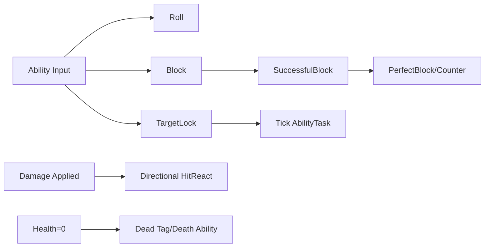

# 06 英雄战斗能力

上一章：[[05-敌人AI]]　返回：[[00-课程索引]]　下一章：[[07-远程敌人]]

> [!info] 实现边界
> 翻滚、格挡、完美格挡、反击和英雄死亡的大部分流程在 Gameplay Ability、GE、Montage 与 Gameplay Cue 资产中；C++ 提供输入语义、方向算法、命中分流、Target Lock 和自定义 Ability Task。下文明确区分二者。

## 本章系统链路

```text
Ability Input → ASC
├─ Roll Ability → 位移/状态/声音
├─ HitReact Event → 方向计算 → 对应受击动画
├─ Block Ability → SuccessfulBlock Event → Perfect Block/Counter
├─ TargetLock Ability → Trace/Widget/TickTask/切换目标
└─ Dead Tag → Hero Death Ability
```

### [P127 Hero Combat Abilities Section Overview](https://www.bilibili.com/video/BV12YCrYCE62?p=127)（02:34）

**提交**：`4129e92 SectionWrapUpDone` 是上一章收尾；本节为新章节概览，无独立实现。

路线：翻滚 → Hero HitReact → Block/Perfect Block/Counter → Target Lock → Hero Death。

### [P128 Planning Ahead](https://www.bilibili.com/video/BV12YCrYCE62?p=128)（01:47）

**提交**：`695ad49 PlanningAheadDone`；主要规划资产。

开发前明确每个 Ability 的：输入 Tag、Ability Tag、Owned/Blocked/Cancel Tags、Montage、Gameplay Event、结束清理和 UI/Cue。状态不应只存在蓝图 bool，应尽量由 ASC Tag 表达。

### [P129 Two-Key Input Action](https://www.bilibili.com/video/BV12YCrYCE62?p=129)（10:19）

**提交**：`bf943ca TwoKeyInputDone`。

新增/使用：

```text
InputTag.Roll
Player.Ability.Roll
Player.Status.Rolling
```

Enhanced Input 中组合 Trigger/Modifier 形成双键翻滚输入；`DA_InputConfig.AbilityInputActions` 将对应 Action 映射到 `InputTag.Roll`。输入仍通过通用 Ability Input 管线，不在 Character 中调用 Roll Ability 类。

### [P130 Get Last Movement Input](https://www.bilibili.com/video/BV12YCrYCE62?p=130)（10:25）

**提交**：`7ba5e67 LastMovementInputDone`；主要 Ability 蓝图课。

翻滚方向读取 Pawn 的 Last Movement Input，而不是 Actor 当前朝向：

```text
移动输入存在 → 使用最后输入方向
无输入 → 使用角色前向作为回退
锁定状态 → 结合目标朝向决定前后左右翻滚动画
```

这样相机朝向变化后，翻滚仍符合玩家输入意图。

### [P131 Rolling Distance](https://www.bilibili.com/video/BV12YCrYCE62?p=131)（08:29）

**提交**：`57a6554 Rolling distance done`；Ability/Montage 配置课。

滚动距离由 `FScalableFloat`/Ability Level 与动画位移配合。应避免同时叠加 Root Motion 和额外位移导致距离翻倍；墙体附近需依赖 Character Movement/碰撞阻挡。

### [P132 Get Value At Level](https://www.bilibili.com/video/BV12YCrYCE62?p=132)（06:44）

**提交**：`0557b2c GetValueAtLevelDone`。

函数库暴露：

```cpp
UFUNCTION(BlueprintPure)
static float GetScalableFloatValueAtLevel(
    const FScalableFloat& InScalableFloat,
    float InLevel = 1.f)
{
    return InScalableFloat.GetValueAtLevel(InLevel);
}
```

蓝图 Ability 可以统一读取按等级缩放的翻滚距离、伤害或消耗，不必在图中手工处理 CurveTable。

### [P133 Rolling Sound FX](https://www.bilibili.com/video/BV12YCrYCE62?p=133)（03:28）

**提交**：`7bf95af RollingSoundFXDone`；Montage/音频资产课。声音放在准确动画帧，Ability 取消时不应再触发后续 Notify。

### [P134 Hero Hit React Ability](https://www.bilibili.com/video/BV12YCrYCE62?p=134)（05:41）

**提交**：`d532471 HitReactAbilityDone`。

Hero 复用共享协议：

```text
Shared.Ability.HitReact
Shared.Event.HitReact
```

Hero HitReact Ability 作为 Reactive Ability 由 Startup Data 授予，配置英雄专属受击 Montage 和取消/阻止规则。

### [P135 Trigger Hero Hit React](https://www.bilibili.com/video/BV12YCrYCE62?p=135)（04:39）

**提交**：`0c82d36`。

```text
敌人攻击 Ability 应用 Damage Spec 成功
→ Send Shared.Event.HitReact 给 Hero
→ Hero HitReact Ability 响应
```

格挡成功路径不会应用正常伤害，因此不会走普通 HitReact。

### [P136 Hero Hit FX](https://www.bilibili.com/video/BV12YCrYCE62?p=136)（06:25）

**提交**：`0b3e248 HeroHitFXDone`；Gameplay Cue/材质/粒子资产课。Cue 参数应携带 Instigator、Target 和命中位置，让表现与实际攻击来源一致。

### [P137 Compute Hit React Direction](https://www.bilibili.com/video/BV12YCrYCE62?p=137)（10:45）

**提交**：`1f89416`。

```cpp
FGameplayTag ComputeHitReactDirectionTag(
    AActor* InAttacker,
    AActor* InVictim,
    float& OutAngleDifference);
```

算法：

```text
VictimForward · VictimToAttacker → cosθ
Cross(VictimForward, VictimToAttacker).Z → 决定正负方向
Acos(dot) → 角度
```

方向区间：

- `[-45°, 45°]`：Front
- `[-135°, -45°)`：Left
- `(45°, 135°]`：Right
- 其余：Back

### [P138 Hit React Tags](https://www.bilibili.com/video/BV12YCrYCE62?p=138)（07:33）

**提交**：`816ae11`。

```text
Shared.Status.HitReact.Front
Shared.Status.HitReact.Left
Shared.Status.HitReact.Right
Shared.Status.HitReact.Back
```

方向函数返回 Gameplay Tag，使动画蓝图和 Ability 不依赖枚举硬编码。

### [P139 Switch On Gameplay Tags](https://www.bilibili.com/video/BV12YCrYCE62?p=139)（06:19）

**提交**：`7749773`；Ability 蓝图课。Hero HitReact Ability 根据方向 Tag 选择 Montage/Section。Gameplay Tag 有层级语义，分支时需明确 Exact 还是父 Tag 匹配。

### [P140 Hit React Sound FX](https://www.bilibili.com/video/BV12YCrYCE62?p=140)（02:27）

**提交**：`b6b6da9`；音频/动画资产课。通过 Sound Concurrency 控制连续受击语音，防止短时间叠加。

### [P141 Hero Block Ability](https://www.bilibili.com/video/BV12YCrYCE62?p=141)（12:49）

**提交**：`95db65a`。

```text
InputTag.MustBeHeld.Block
Player.Ability.Block
Player.Status.Blocking
```

ASC 松开逻辑：

```cpp
if (InInputTag.MatchesTag(InputTag_MustBeHeld) && Spec.IsActive())
{
    CancelAbilityHandle(Spec.Handle);
}
```

因此按下激活 Block Ability，松开取消；Blocking 状态由 Ability/GE 在持续期间授予。

### [P142 Add Gameplay Cue To Owner](https://www.bilibili.com/video/BV12YCrYCE62?p=142)（14:00）

**提交**：`21df167`；Block Ability/Cue 资产课。持续护盾 Cue 在 Ability 激活时添加，结束或取消时移除。Cue 生命周期必须覆盖正常结束和被其他 Ability 强制取消。

### [P143 Is Valid Block](https://www.bilibili.com/video/BV12YCrYCE62?p=143)（10:49）

**提交**：`7e911a5`。

```cpp
bool UWarriorFunctionLibrary::IsValidBlock(AActor* Attacker, AActor* Defender)
{
    const float Dot = FVector::DotProduct(
        Attacker->GetActorForwardVector(),
        Defender->GetActorForwardVector());
    return Dot < -0.1f;
}
```

课程最终源码比较双方 Forward Vector，朝向相反时认为面对攻击。它并未使用“防御者指向攻击者的位置向量”，因此是简化判定。

### [P144 Notify Successful Block](https://www.bilibili.com/video/BV12YCrYCE62?p=144)（04:54）

**提交**：`0137ea3`。

Enemy Combat：

```text
玩家有 Player.Status.Blocking
且攻击者没有 Enemy.Status.Unbloackable
且 IsValidBlock=true
→ Send Player.Event.SuccessfulBlock 给 Hero
否则 → Send Shared.Event.MeleeHit 给 Enemy Ability
```

伤害在分流之后处理，成功格挡不会继续应用正常伤害 Spec。

### [P145 Handle Successful Block](https://www.bilibili.com/video/BV12YCrYCE62?p=145)（09:38）

**提交演进**：`331e258` + `fafe2a2`。

Block Ability 等待 `Player.Event.SuccessfulBlock`，随后播放格挡反馈、护盾 Cue、音效/Hit Pause。Config 中实际 Cue 拼写：

```text
GameplayCue.FX.MagicShield.SuceessfulBlock
```

拼写虽然错误，但 C++/资产必须保持一致。

### [P146 Is Perfect Block](https://www.bilibili.com/video/BV12YCrYCE62?p=146)（04:58）

**提交**：`ad5078b`；蓝图时序课。

C++ 中没有 PerfectBlock 状态或函数。完美格挡窗口由 Block Ability 内部时序、短时 GE 或 Ability Task 实现；精确窗口长度需打开资产确认。

### [P147 Notify Perfect Block](https://www.bilibili.com/video/BV12YCrYCE62?p=147)（08:31）

**提交**：`831281f`；Gameplay Cue/Ability 蓝图课。

配置存在：`GameplayCue.FX.MagicShield.PerfectBlock`。普通成功格挡事件先进入 Block Ability，再由内部窗口判断普通/完美分支。

### [P148 Initiate Counterattack](https://www.bilibili.com/video/BV12YCrYCE62?p=148)（13:02）

**提交**：`8fe1388`；Ability 蓝图课。

公开 C++ 没有 Counter Ability 类或原生 Counter Tag。反击由 Block Ability 在完美格挡分支中启动/开放；目标和窗口生命周期由蓝图处理。

### [P149 Set Up Target Lock Ability](https://www.bilibili.com/video/BV12YCrYCE62?p=149)（09:10）

**提交组合**：`0891797 Heading for target lock` + `d177a3b SetUpToggleTargetLockDone`。

新类：

```cpp
class UHeroGameplayAbility_TargetLock : public UWarriorHeroGameplayAbility
```

Tag：

```text
InputTag.Toggleable.TargetLock
Player.Ability.TargetLock
Player.Status.TargetLock
```

Toggleable 输入再次按下时，ASC 对 Active Spec 调用 `CancelAbilityHandle`。

### [P150 Toggle Target Lock](https://www.bilibili.com/video/BV12YCrYCE62?p=150)（06:17）

Target Lock Ability 覆盖 `ActivateAbility`、`EndAbility`。最终源码的清理职责是：

```text
EndAbility
├─ ResetTargetLockMovement：恢复缓存的移动速度
├─ ResetTargetLockMappingContext：移除锁定输入上下文
└─ CleanUp：清空候选/当前目标、移除 Widget、重置缓存尺寸和速度变量
```

`CancelTargetLockAbility` 负责请求取消；第一次按下走 `TryActivateAbility`，再次按下由 Toggleable 分支调用 `CancelAbilityHandle`，最终统一进入 `EndAbility`。

### [P151 Get Available Targets](https://www.bilibili.com/video/BV12YCrYCE62?p=151)（13:18）

**提交**：`89c0ffd`。

`GetAvailableActorsToLock` 使用 `UKismetSystemLibrary::BoxTraceMultiForObjects` 沿 Hero 前向获取候选，并去重加入数组。

> [!warning] 最终 C++ 没有显式过滤敌对、死亡或可锁定接口，正确性依赖 Object Types/Trace 配置和后续检查。

### [P152 Get Nearest Target](https://www.bilibili.com/video/BV12YCrYCE62?p=152)（09:18）

**提交**：`4c69448`。

```cpp
UGameplayStatics::FindNearestActor(
    HeroLocation, AvailableActors, Distance);
```

候选为空时取消 Ability；找到后写入 `CurrentLockedActor`。

### [P153 Draw Target Lock Widget](https://www.bilibili.com/video/BV12YCrYCE62?p=153)（09:40）

**提交**：`f15f08e`。

字段：`TSubclassOf<UWarriorWidgetBase> TargetLockWidgetClass`、`UWarriorWidgetBase* DrawnTargetLockWidget`。

`DrawTargetLockWidget` 只负责创建 Widget 并加入 Viewport。`SetTargetLockWidgetPosition` 首次执行时遍历 Widget/SizeBox 并缓存尺寸，之后用该尺寸完成屏幕居中偏移。

### [P154 Set Target Lock Widget Position](https://www.bilibili.com/video/BV12YCrYCE62?p=154)（11:14）

**提交**：`e4a3b44`。

```text
CurrentLockedActor 世界位置
→ ProjectWorldLocationToWidgetPosition
→ 减去 WidgetSize/2
→ SetPositionInViewport
```

投影失败或目标进入镜头后方时应隐藏/取消锁定。

### [P155 Execute Task On Tick](https://www.bilibili.com/video/BV12YCrYCE62?p=155)（10:48）

**提交**：`bfbbd91`。

```cpp
class UAbilityTask_ExecuteTaskOnTick : public UAbilityTask
```

```cpp
static UAbilityTask_ExecuteTaskOnTick* ExecuteTaskOnTick(UGameplayAbility* OwningAbility);
virtual void TickTask(float DeltaTime) override;
```

构造设 `bTickingTask=true`；每帧广播 `OnAbilityTaskTick(DeltaTime)`，Ability 结束后 `EndTask()`。

### [P156 On Target Lock Tick](https://www.bilibili.com/video/BV12YCrYCE62?p=156)（06:26）

**提交**：`b1273a6`。

```cpp
void UHeroGameplayAbility_TargetLock::OnTargetLockTick(float DeltaTime)
```

每帧：验证 Hero/Target 是否 Dead、更新锁定图标、判断是否允许覆盖旋转。候选搜索不会每帧执行，避免无意义 Trace。

### [P157 Orient To Target While Target Lock](https://www.bilibili.com/video/BV12YCrYCE62?p=157)（08:43）

**提交**：`fd04b69`。

```text
FindLookAtRotation(Hero, Target)
→ RInterpTo(CurrentControlRotation, TargetRotation)
→ Controller.SetControlRotation
→ Hero.SetActorRotation(Yaw)
```

当 Hero 有 `Player.Status.Rolling` 或 `Player.Status.Blocking` 时暂停锁定强制转向，避免覆盖能力自身方向。

### [P158 Switch To Target Lock Poses](https://www.bilibili.com/video/BV12YCrYCE62?p=158)（09:26）

**提交**：`f8a6d38`；AnimBP/Ability 配置课。`Player.Status.TargetLock` 驱动锁定姿势和 Strafing Locomotion；C++ TargetLock 类不直接添加该 Tag，通常由 Ability Owned Tags 管理。

### [P159 Target Lock Walk Speed](https://www.bilibili.com/video/BV12YCrYCE62?p=159)（07:42）

本节对应同一提交阶段。TargetLock Ability 缓存默认速度，激活时设置：

```cpp
TargetLockMaxWalkSpeed = 150.f;
```

结束时恢复缓存值，不能写死为假定默认速度。

### [P160 Switch Target Input Action](https://www.bilibili.com/video/BV12YCrYCE62?p=160)（06:45）

**提交**：`b9bf6ab`。

Hero Character 绑定：

```cpp
InputTag.SwitchTarget
Triggered → Input_SwitchTargetTriggered
Completed → Input_SwitchTargetCompleted
```

Triggered 缓存 `FVector2D SwitchDirection`，Completed 根据 X 正负发送左/右 Gameplay Event。

### [P161 Target Lock Mapping Context](https://www.bilibili.com/video/BV12YCrYCE62?p=161)（09:21）

**提交**：`09978ed`。

TargetLock Ability 字段：

```cpp
UInputMappingContext* TargetLockMappingContext;
```

激活时以优先级 3 添加，结束时移除，从而暂时把普通 Look 输入切换为左右选敌输入。

### [P162 Notify Switch Target](https://www.bilibili.com/video/BV12YCrYCE62?p=162)（08:26）

**提交**：`10f53e6`。

```text
Player.Event.SwitchTarget.Left
Player.Event.SwitchTarget.Right
```

`Input_SwitchTargetCompleted` 构造 EventData 并发送给 Hero；TargetLock Ability 蓝图通过 Wait Gameplay Event 接收。

### [P163 Handle Switch Target](https://www.bilibili.com/video/BV12YCrYCE62?p=163)（13:44）

**提交**：`8653571`。

`GetAvailableActorsAroundTarget` 用叉积 Z 值把候选分为当前目标左侧/右侧；`SwitchTarget(Tag)` 从对应数组选择最近目标，找不到时保持当前目标。

```text
重新 Trace 候选 → 排除 CurrentLockedActor
→ Cross(PlayerToCurrent, PlayerToCandidate).Z
→ LeftActors / RightActors
→ FindNearestActor → 替换 CurrentLockedActor
```

### [P164 Hero Death](https://www.bilibili.com/video/BV12YCrYCE62?p=164)（13:26）

**提交组合**：`a2c70a2 HeroDeathAbilityDone` + `5422c3e HeroDeathModifyDone`。

共享 Tag：`Shared.Ability.Death`、`Shared.Status.Dead`。生命归零时 AttributeSet 添加 Dead Tag，Hero Death Ability 响应并取消锁定/战斗能力、处理输入和死亡 Montage。具体清理节点位于 Ability 蓝图。

### [P165 Tweaking Target Lock](https://www.bilibili.com/video/BV12YCrYCE62?p=165)（05:08）

**提交**：`4d1823f`。

最终可调字段包括：Trace 距离/盒体尺寸、旋转插值速度、锁定移动速度、Mapping Context、镜头偏移、Widget Class。重点测试目标死亡、销毁、超距、多个候选和锁定中翻滚/格挡。

### [P166 Section Wrap Up](https://www.bilibili.com/video/BV12YCrYCE62?p=166)（02:16）

**提交**：`b4e63e9`；总结课。



## 关键审计结论

- `IsValidBlock` 比较双方 Forward，并非攻击者位置向量。
- Perfect Block/Counter 没有原生 C++ 状态机，不能虚构 C++ 实现。
- Target Trace 未显式过滤敌对和 Dead。
- TargetLock 激活失败后的初始化/清理顺序要关注。
- `Input_SwitchTargetCompleted` 的 X=0 会落到 Left 分支。
