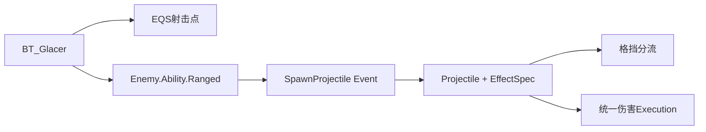

# 07 远程敌人

上一章：[[06-英雄战斗能力]]　返回：[[00-课程索引]]

## 核心架构

```text
BT_Glacer → EQS寻找射击位置 → 激活 Enemy.Ability.Ranged
→ Projectile Ability 播放 Montage
→ Shared.Event.SpawnProjectile
→ Spawn AWarriorProjectileBase 并注入 EffectSpec
→ Hit/Overlap → 格挡分流或 Apply Spec → HitReact
```

### [P167 Ranged Enemy Section Overview](https://www.bilibili.com/video/BV12YCrYCE62?p=167)（01:20）

**提交**：`a7fddbf ReadyForNextSection`；章节概览。目标是复用现有 Enemy、AI、GAS 和 Damage 管线扩展 Glacer，而不是复制一套远程战斗框架。

### [P168 Ranged Enemy Starting Weapon](https://www.bilibili.com/video/BV12YCrYCE62?p=168)（07:39）

**提交**：`30487a8 StartingWeaponStatsDone_NoCode`；资产/Data Asset 课。

资产：`BP_Glacer_Weapon`、`BP_Gruntling_Glacer`、`DA_Glacer`、`GA_Glacer_SpawnWeapon`。

```text
DA_Glacer → 授予 OnGiven SpawnWeapon Ability
→ Spawn/Attach BP_Glacer_Weapon
→ RegisterSpawnedWeapon(Enemy.Weapon, Weapon, true)
```

### [P169 Glacer Starting Stats](https://www.bilibili.com/video/BV12YCrYCE62?p=169)（04:28）

与上一提交共同配置 `CT_GlacerStats`、`GE_Glacer_StartUp`、`DA_Glacer`。Glacer 仍使用统一的 `UWarriorAttributeSet`，差异来自 CurveTable/GE 和 Ability Level。

### [P170 Glacer Hit React](https://www.bilibili.com/video/BV12YCrYCE62?p=170)（08:38）

**提交**：`5835715 GlacerDeathHitReactDeathDone_NoCode`；资产课。

`DA_Glacer` 组合共享 HitReact/Death Ability；本提交可确认修改了 Glacer 材质、Mesh、Death Ability 和溶解 Niagara。HitReact/Death 的具体动画资产关系没有出现在提交清单中，需打开 Glacer 蓝图与 Ability 图表确认；方向算法、Dead Tag 与 Damage 管线继续复用。

### [P171 Ranged Behavior Tree](https://www.bilibili.com/video/BV12YCrYCE62?p=171)（05:15）

**提交**：`680a474 GlacerBehaviorTreeDone`。

资产：`AIC_Glacer`、`BT_Glacer`。本节只建立 Glacer AIController/Behavior Tree 骨架，并复用 C++ 感知写入的 `Blackboard.TargetActor`。射击位置 EQS 在 P172 接入，远程 Ability 在 P173 接入，近战分支到 P181 才完成，因此不能把最终分支结构提前归到 P171。

### [P172 Find Shooting Position](https://www.bilibili.com/video/BV12YCrYCE62?p=172)（08:13）

**提交组合**：`193f37d` + `ad7b412`；EQS 资产课。

`EQS_FindShootProjectileLocation` 使用 `EQSContext_TargetActor`，从可导航候选中筛选合适射击点。距离、可见性和评分权重需打开资产确认，不应按常见做法杜撰具体数值。

### [P173 Projectile Ability](https://www.bilibili.com/video/BV12YCrYCE62?p=173)（08:29）

**提交**：`9d4bdd9 ProjectileAbilityDone_NoCode`。

`GA_Glacer_Projectile` 使用 `Enemy.Ability.Ranged`；由 `DA_Glacer.EnemyCombatAbilities` 授予，BT 通过 `TryActivateAbilityByTag` 激活。Ability 播放 Cast Montage 并等待生成投射物事件。

### [P174 Projectile Class](https://www.bilibili.com/video/BV12YCrYCE62?p=174)（12:56）

**提交**：`06f0e5a ProjectileClassDone`。

```cpp
class AWarriorProjectileBase : public AActor
```

组件：

```cpp
UBoxComponent* ProjectileCollisionBox;
UNiagaraComponent* ProjectileNiagaraComponent;
UProjectileMovementComponent* ProjectileMovementComp;
```

默认运动：

```text
InitialSpeed=700
MaxSpeed=900
GravityScale=0
InitialLifeSpan=4秒
```

伤害策略：

```cpp
enum class EProjectileDamagePolicy : uint8
{
    OnHit,
    OnBeginOverlap
};
```

`Build.cs` 加入 Niagara 模块。

### [P175 Spawning Projectile](https://www.bilibili.com/video/BV12YCrYCE62?p=175)（07:56）

**提交**：`c89c7cc`。新增 `Shared.Event.SpawnProjectile`。

```text
Cast Montage 的 AnimNotify
→ Shared.Event.SpawnProjectile
→ GA_Glacer_Projectile 等待到事件
→ 从武器发射 Socket 取位置
→ 计算朝向 TargetActor 的 Rotation
→ Spawn BP_Projectile_Glacer
```

Spawn 时必须设置 `Instigator=Glacer`，因为敌我判断、Source ASC 和伤害属性都依赖它。

### [P176 On Projectile Hit](https://www.bilibili.com/video/BV12YCrYCE62?p=176)（09:14）

**提交**：`045cf8d`。

构造时绑定：

```cpp
OnComponentHit.AddUniqueDynamic(this, &ThisClass::OnProjectileHit);
OnComponentBeginOverlap.AddUniqueDynamic(this, &ThisClass::OnProjectileBeginOverlap);
```

`BeginPlay` 根据 DamagePolicy 将 Pawn 响应设为 Block 或 Overlap。Hit 适合单发弹体；Overlap 可用于穿透/持续区域。

### [P177 Handle Projectile Hit](https://www.bilibili.com/video/BV12YCrYCE62?p=177)（12:39）

**提交**：`3e039f7`，并有行为树更新提交 `7aa39b2`。

Hit 流程：

```text
BP_OnSpawnProjectileHitFX(ImpactPoint)
→ OtherActor 转 Pawn
→ IsTargetPawnHostile
→ 检查 Player.Status.Blocking
→ IsValidBlock
├─ 有效：Send Player.Event.SuccessfulBlock
└─ 无效：HandleApplyProjectileDamage
→ Destroy
```

Overlap 路径不检查格挡，使用 `OverlappedActors` 去重且不立即销毁，适合穿透型投射物。

### [P178 Projectile Spec Handle](https://www.bilibili.com/video/BV12YCrYCE62?p=178)（10:58）

**提交**：`dd65656`。

```cpp
UPROPERTY(BlueprintReadOnly, meta=(ExposeOnSpawn="true"))
FGameplayEffectSpecHandle ProjectileDamageEffectSpecHandle;
```

设计重点：Spec 在发射 Ability 中构造，保留 Instigator、Ability Level 和 SetByCaller 数据；投射物只携带和应用，不在命中时重新猜测伤害。

### [P179 Make Projectile Spec Handle](https://www.bilibili.com/video/BV12YCrYCE62?p=179)（03:00）

**提交**：`c26343c`。

调用：

```cpp
UWarriorEnemyGameplayAbility::MakeEnemyDamageEffectSpecHandle(
    EffectClass, DamageScalableFloat);
```

```text
MakeEffectContext
→ SetAbility / AddSourceObject / AddInstigator
→ MakeOutgoingSpec(AbilityLevel)
→ Shared.SetByCaller.BaseDamage = FScalableFloat.GetValueAtLevel(Level)
→ Spawn Actor 参数注入 ProjectileDamageEffectSpecHandle
```

### [P180 Projectile Sound FX](https://www.bilibili.com/video/BV12YCrYCE62?p=180)（06:53）

**提交**：`ca472d8`；表现资产课。

`BP_Projectile_Glacer` 配置发射、飞行、命中声音和 Niagara Trail。C++ 扩展点：

```cpp
UFUNCTION(BlueprintImplementableEvent)
void BP_OnSpawnProjectileHitFX(const FVector& HitLocation);
```

### [P181 Glacer Melee Ability](https://www.bilibili.com/video/BV12YCrYCE62?p=181)（08:17）

**提交**：`be3a362 GlacerMeleeAbilityDone_NoCode`。

资产：`GA_Glacer_Melee_1`、Melee Montage、`BT_Glacer`、`DA_Glacer`。

```text
目标距离适合远程 → Enemy.Ability.Ranged
目标过近/近战条件 → Enemy.Ability.Melee
```

两者都由 Tag 激活，行为树不依赖具体 Ability 类。

### [P182 Unblockable Attack](https://www.bilibili.com/video/BV12YCrYCE62?p=182)（09:36）

**提交**：`e208658`，后续 `cf91f82` 调整 EnemyCombatComponent。

状态 Tag 的实际拼写：

```text
Enemy.Status.Unbloackable
```

Enemy Combat：

```cpp
const bool bBlocking = NativeDoesActorHaveTag(HitActor, Player_Status_Blocking);
const bool bUnblockable = NativeDoesActorHaveTag(GetOwningPawn(), Enemy_Status_Unbloackable);

if (bBlocking && !bUnblockable)
{
    bIsValidBlock = IsValidBlock(GetOwningPawn(), HitActor);
}
```

警告 Cue 使用正确拼写：`GameplayCue.FX.UnblockableWarning`。

> [!warning] 不可格挡 Tag 只在敌人近战 `UEnemyCombatComponent` 路径检查；`AWarriorProjectileBase::OnProjectileHit` 没有检查它，因此不能说所有投射物天然不可格挡。

### [P183 Combat Test Map](https://www.bilibili.com/video/BV12YCrYCE62?p=183)（08:03）

**提交**：`0ec06f2`；地图/行为树集成测试。

测试覆盖：

- Glacer EQS 射击选位。
- Ranged/Melee 分支切换。
- 投射物 Hit/Overlap 策略。
- 普通格挡与不可格挡攻击。
- 多敌人导航、锁定、受击、死亡和 UI。

### [P184 Section Wrap Up](https://www.bilibili.com/video/BV12YCrYCE62?p=184)（00:52）

**提交**：`7f7e2fc ReadyForBossSection`；总结课。



## EffectSpec 传递链

```text
CT_GlacerStats/FScalableFloat
→ Enemy Ability.MakeEnemyDamageEffectSpecHandle
→ EffectContext(Ability/SourceObject/Instigator)
→ SetByCaller BaseDamage
→ ExposeOnSpawn 注入 Projectile
→ Hit/Overlap
→ FunctionLibrary.ApplyGameplayEffectSpecHandleToTargetActor
→ SourceASC.ApplyGameplayEffectSpecToTarget
→ GEExecCalc_DamageTaken
```

## Hit 与 Overlap 对比

| 行为 | OnHit | OnBeginOverlap |
|---|---|---|
| Pawn 响应 | Block | Overlap |
| 命中 FX | 有 | 当前 C++ 未调用 |
| 格挡判定 | 有 | 无 |
| 命中后销毁 | 是 | 否 |
| 去重 | 依赖销毁 | `OverlappedActors` |
| 适用 | 单发弹体 | 穿透/持续范围 |

## 本章源码检查

- [ ] Spawn 时设置正确 `Instigator`。
- [ ] Spec 有效后再解引用 `SpecHandle.Data`。
- [ ] 世界静态物不尝试读取 ASC。
- [ ] 明确选择 Hit 或 Overlap 策略。
- [ ] 不把近战不可格挡规则误认为已覆盖投射物。
